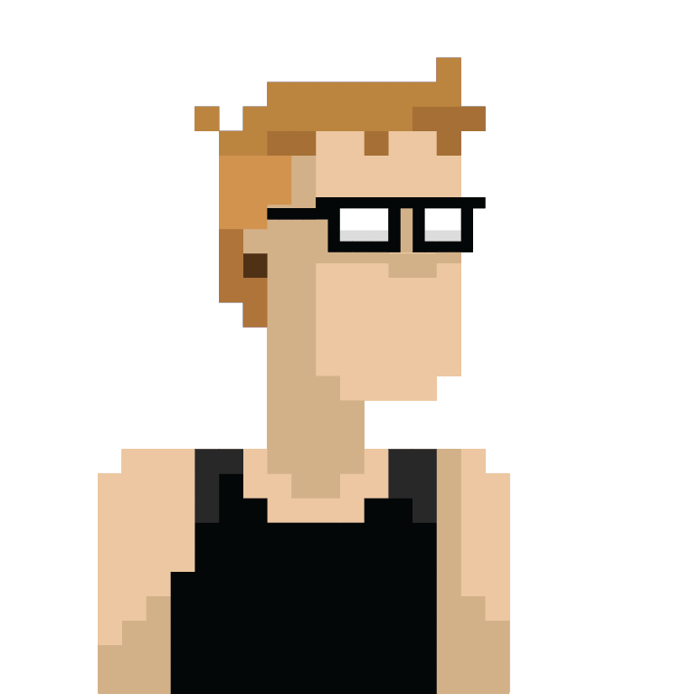

# http://www.basvandriel.nl/ 

This project contains my personal website, for sharing information about who I am, contacting me, reading my resume and blogs.

The idea initially came from that I needed to learn more about principles about object-oriented programming.

## Contribution
Contributions to the project are currently closed - see the [CONTRIBUTION.md](CONTRIBUTION.md) file for details.

## License

This project is licensed under the MIT License - see the [LICENSE](LICENSE.md) file for details

## Authors
This project was initially created by [Bas van Driel](https://github.com/basvandriel "GitHub page") ([@bvandriel](https://twitter.com/bvandriel "Twitter page")), where [these people](https://github.com/basvandriel/WWW/graphs/contributors) contributed to it.

## Links

* [~~Website~~](http://www.basvandriel.nl/) _(currently offline)_
* [Issue tracker](https://github.com/basvandriel/WWW/issues)
* [Source code](https://github.com/basvandriel/WWW)